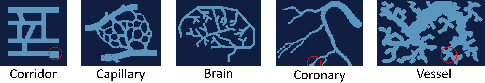

[](https://github.com/psf/black)

# Gym Gathering

Python package providing [OpenAI-gym](https://github.com/openai/gym) - compatible environments for the particle gathering task.

# Getting started

### Particle Gathering
Particle gathering is an algorithmic problem where particles - which are randomly distributed in a maze-like environment - should be gathered at a single position using only global control inputs.
This means that particles cannot be moved individually and instead all particles are moved into the same direction at the same time. 
Just think of the particles as magnetic dust in a maze, surrounded by powerful electronic magnets.

This problem becomes interesting in scenarios where a certain payload should be brought to a target by very small agents that do not have enough volume to store the energy for their own movements. 
An example would be the transport of particles inside the human body (e.g. to combat a tumor).

## Installation
Currently installation can be done by cloning this repository and using `pip` for a local installation. 

#### Install from pip
**Note:** A PyPI package will be released soon.

#### Install from source
To install the package directly from this repository, you can simply clone it and run the installation process using pip:
```
git clone https://github.com/NeoExtended/gym-gathering.git
cd gym-gathering
pip install -e .
```

# Simulation Environment
This package adds a series of named gym-environments in a combination of various parameters.
Each environment can be further customized - especially the reward function and the observations can be either selected from a number of existing choices, or even custom-built.
Episodes for every environment will be automatically truncated after 2000 steps of interaction.


### Mazes
This package comes with five fixed mazes:



Particles can move in the light blue areas and get blocked by the dark blue areas.
Each maze has a default goal position (marked by a red circle).

Additionally, mazes with vessel-like structure can be randomly generated. 

### Particle Physics
The simulation can be run using two different modes depending on the desired behavior of the particles.

#### Algorithmic particles
In the *algorithmic* mode, particles directly change their positions.
This means that in every step, each particle which is not blocked by a wall will move exactly one pixel.
If two particles enter the same pixel they will merge and never split up again.

#### Physical particles
In the *physical* mode, particles are accelerated and change their positions depending on their current speed.
Particles also are affected by drag and we account for inter-particle collision if more than 3 particles enter the same pixel.
Particles have a randomized weight and therefore may split up again, even if the previously entered the same pixel.

### Goal Positions
Each maze comes with a fixed default goal position. 
Additionaly, goal positions can be set to random, which results in a new goal position after each episode.
If you want to manually set a goal position, it can pass the coordinates of the goal using the `goal` parameter.

### Number of particles
Particles are randomly distributed over each possible free location of the selected maze.
By default, 256 randomly generated particles are created at the start of each episode.
The number of particles can be controlled by the `n_particles` parameter, which can be set to a range by passing a tuple, or to `filled` to create a completely filled maze.

### Naming


# Benchmarks