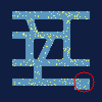

[](https://github.com/psf/black)

# Gym Gathering

Python package providing [OpenAI-gym](https://github.com/openai/gym) - compatible environments for the particle gathering task.

# Getting started

### Particle Gathering
Particle gathering is an algorithmic problem where particles - which are randomly distributed in a maze-like environment - should be gathered at a single position using only global control inputs.
This means that particles cannot be moved individually and instead all particles are moved into the same direction at the same time. 
Just think of the particles as magnetic dust in a maze, surrounded by powerful electronic magnets.

This problem becomes interesting in scenarios where a certain payload should be brought to a target by very small agents that do not have enough volume to store the energy for their own movements. 
An example would be the transport of particles inside the human body (e.g. to combat a tumor).

### Installation
Currently, installation can be done by cloning this repository and using `pip` for a local installation. 

#### Install from pip
The easiest way to install the environments is to use the available pip package using:
```
pip install gym-gathering
```

#### Install from source
To install the package directly from this repository, you can simply clone it and run the installation process using pip:
```
git clone https://github.com/NeoExtended/gym-gathering.git
cd gym-gathering
pip install -e .
```

This also includes a [script](run_env_as_player.py) which lets you play the environments yourself using the arrow keys.

#### Basic Usage
The following is a very basic usage example.
The available environments are discussed [here](https://github.com/NeoExtended/gym-gathering#environment-naming).

```python
import gym
import gym_gathering  # This is needed to register the environments

env = gym.make("CorridorAlgorithmicFixedPCFixedGoal-v0")
observation, info = env.reset(seed=42, return_info=True)
done = False
total_reward = 0
length = 0

while not done:
    action = env.action_space.sample()  # Replace the random sample by your agent
    observation, reward, done, info = env.step(action)
    total_reward += reward
    length += 1
    # env.render() # optionally render the environment
    
env.close()
print(f"Total reward: {total_reward}, episode length: {length}")
```

# Simulation Environment
This package adds a series of named gym-environments in a combination of various parameters.
Each environment can be further customized - especially the reward function and the observations can be either selected from a number of existing choices, or even custom-built.
Episodes for every environment will be automatically truncated after 2000 steps of interaction.

## Properties

### Mazes
This package includes five different maze environments:


Particles can move in the light blue areas and get blocked by the dark blue areas.
Each maze has a default goal position (marked by a red circle).

Additionally, mazes with vessel-like structure can be randomly generated.
The generation is based on rapidly exploring random trees (RRTs).
Two different environments can be selected which simulate different behavior:
1. `RandomRRT`: For every episode a new maze is generated. The goal position will be randomly selected from the set of free pixels.
2. `StagesRRT`: Mazes work like levels in a video game. The agent will act in the first maze (called stage) until it successfully solves it. Then the environment advances to the next stage. If the agent fails to complete the episode before it gets truncated, the environment returns to stage 0. Goal positions will be randomly selected for each new episode. 

### Particle Physics
The simulation can be run using two different modes depending on the desired behavior of the particles.

#### Algorithmic particles
In the *algorithmic* mode, particles directly change their positions.
This means that in every step, each particle which is not blocked by a wall will move exactly one pixel.
If two particles enter the same pixel they will merge and never split up again.

#### Fuzzy particles
In the *fuzzy* physics mode, particles behave similar to algorithmic particles, but introduce randomized errors to the particle control.
At each step and for each particle there is a chance to move into a random direction and particles may ignore the given action.
Particles which have previously merged will still stick together and not split up again.

#### Physical particles
In the *physical* mode, particles are accelerated and change their positions depending on their current speed.
Particles also are affected by drag, and we account for inter-particle collision if more than 3 particles enter the same pixel.
Particles have a randomized weight and therefore may split up again, even if they previously entered the same pixel.

### Goal Positions
Each maze comes with a fixed default goal position. 
Additionally, goal positions can be set to random, which results in a new goal position after each episode.
If you want to manually set a goal position, it can pass the coordinates of the goal using the `goal` parameter.

### Number of particles
Particles are randomly distributed over each possible free location of the selected maze.
By default, 256 randomly generated particles are created at the start of each episode.
The number of particles can be controlled by the `n_particles` parameter, which can be set to a range by passing a tuple, or to `filled` to create a completely filled maze.

### Environment Naming
Depending on the desired behavior of the environment, this package creates a number of pre-defined named environments which follow a nomenclature:

```
[Maze][PhysicsType][ParticleCount][GoalType]-v0

Examples:
CorridorAlgorithmicFixedPCFixedGoal-v0
BrainPhysicalRandomPCRandomGoal-v0
```

The possible values are listed below:

| Parameter     | Description                                          | Possible Values                                                                  | 
|---------------|------------------------------------------------------|----------------------------------------------------------------------------------|
| Maze          | Controls the type of the maze.                       | `Corridor`, `Capillary`, `Brain`, `Coronary`, `Vessel`, `StagesRRT`, `RandomRRT` |
| PhysicsType   | Controls the type of the environment physics.        | `Algorithmic`, `Physical`, `Fuzzy`                                               |
| ParticleCount | Controls the number of randomly generated particles. | `FixedPC`, `RandomPC`, `FilledPC`                                                |
| GoalType      | Controls the selection of the goal position.         | `FixedGoal`, `RandomGoal`                                                        |

## Interaction
For the particle gathering task, specific observations and rewards are not strictly enforced.
If you find a better way to encode the environment information, or to provide feedback to the RL agent, we highly encourage doing so.
However, this package contains a number of default observations and a reward generation toolkit to make it easy to experiment with the environments.

### Observations
By default, observations are encoded as a single-channel image which has the size of the selected maze.
The image represents a binary encoding of the position of each particle (positions containing particles will have a value of 255). 

Environments with random goal positions will add a second image channel, encoding the position of the goal.
Additionally, environments which also randomize the shape of the maze will provide a third image channel which contains the shape of the current maze.

### Rewards
By default, rewards are generated from the change in two metrics: 
1. The maximum distance any particle is away from the goal position
2. The average distance of any particle to the goal position

Both metrics are scaled to be approximately in the interval [0, 1] to have an equal influence.
Additionally, the agent receives a small time-penalty at each step.

### Actions
Particles can be moved into one of eight directions:

| Action | Direction  |
|--------|------------|
| 0      | East       |
| 1      | South-East |
| 2      | South      |
| 3      | South-West |
| 4      | West       |
| 5      | North-West |
| 6      | North      |
| 7      | North-East |

# Reference

### Parameters
If you want to further customize the environment you can pass `kwargs` to `gym.make()` when creating the environment.
Below is a list of parameters which change the default behavior of the environment:


| Parameter            | Description                                                                                                                                                 | Default Value | Possible Values                                                                                                                                                               | 
|----------------------|-------------------------------------------------------------------------------------------------------------------------------------------------------------|---------------|-------------------------------------------------------------------------------------------------------------------------------------------------------------------------------|
| `goal`               | Center of the target location (may be random).                                                                                                              |               | `Tuple[int, int]`, `None`                                                                                                                                                     |
| `goal_range`         | Size of the target location.                                                                                                                                | 10            | `int`                                                                                                                                                                         |
| `n_particles`        | Number of particles. Pass `filled` for a completely filled maze.                                                                                            | 256           | `int`, `Tuple[int, int]`, `filled`, `random`                                                                                                                                  |
| `allow_diagonal`     | Allows or disallows the use of diagonal particle movements.                                                                                                 | True          | `bool`                                                                                                                                                                        |
| `reward_type`        | Pass a class of the type `RewardGenerator` which gets called after every step to calculate the reward. Also accepts names of pre-defined reward generators. | `continuous`  |                                                                                                                                                                               |
| `reward_kwargs`      | Additional arguments which should be passed to the reward generator                                                                                         |               |                                                                                                                                                                               |
| `step_type`          | Pass a class of the type `StepModifier` to control how particles move. Also accepts names of pre-defined step-generators.                                   | `simple`      | `simple` for algorithmic particles and `physical` for physical particles                                                                                                      |
| `step_kwargs`        | Additional arguments which should be passed to the step modifier                                                                                            |               |                                                                                                                                                                               |
| `observation_type`   | Pass a class of the type `ObservationGenerator` to generate observations after each step. Also accepts names of pre-defined observation-generators.         | `simple`      | `simple` for a single-channel image, `multichannel` for a generator which encodes information into separate channels, `real-world` for distorted single-channel observations. |
 | `observation_kwargs` | Additional arguments which should be passed to the observation generator                                                                                    |               |                                                                                                                                                                               |
 
### Functions
Usually the environment should be fully-parameterized at the beginning of the training process. 
However, in a few cases, it might be necessary to change parameters during training. 
To update any value of the member objects (e.g. the observation generator), you can use the function `set_value(obj, parameter_name, value)`.

